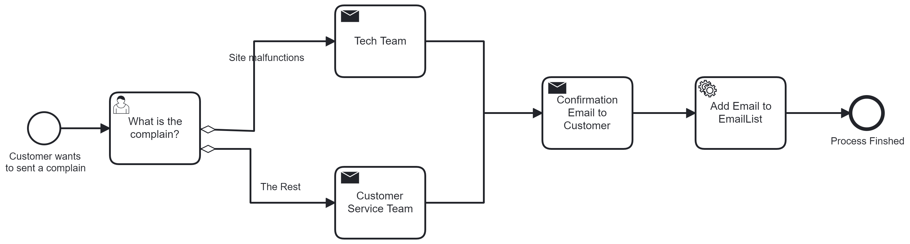
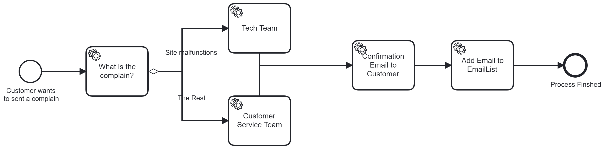

# Mini-Project-2_Business-Process-Modelling

## Objectives of this Assignment
The main objective of this task is to help you get familiar with the business context of system integration and to provide practical experience in modelling and automation of business processes by implementation of standard methods and notation.

**Tasks**

The task is to design a business process and develop a software application workflow, which integrates
and automates several disparate operations.
You can choose between processes related to either

a) organization of marketing campaigns

*b) handling of customer complains*

I choice process B for this assignment

**Requirements**

In this assignment I have to implement a process with business rules, software services and human tasks. 

## The Application

The application has two different ways to be executed. The first approach is through the server application made through springboot. Within this service application can you start a process which gives you tasks to solve for completing the process. The second way is through a Javascript console application that asks you a couple of questions before executing the entire process

**The Process**

My approach to handle customer complains is through a human task where the customer fills out a set of questions to give the best idea of what his issue is to the customer service. 

The questions:

-Name

-Email

-Which type of complain

-Details about the complain

After the customer has filled this form in the server application (camunda-server) or answered the questions in the console application (Javascript) then the server will check if the issue is relevant to the customer service or to the tech team. If the issue is about the site, then the complain will be sent to the tech team otherwise will the complain proceed to the customer service. The releveant team will then recieve a mail by the auto mail sender about the complain, while the customer will receive a confirmation letter by the auto mail sender. Lastlly will the customer's mail be inserted into a email list within the Java project.

There is a small different between the two processes due to the console application not being able to send emails within the process (for some weird reason). Another difference, the console application doesn't contain a human task, because you can't execute a human task outside the server application.

###The Methods

<strong>Java Project:</strong>

AddEmailToEmailList = takes the email from the inserted information by the customer and add this email into a file called emailList.

AutoResponseForANewComplain = takes teh email from the inserted information by the customer and sends a confirmation letter to the mail.

MailToTheCustomerService = if the complain type isn't about the site then customer service will receive a mail by the auto mail sender about the user complain.

MailToTheTechTeam = if the complain type is about the site then the tech team will receive a mail by the auto mail sender about the user complain.

<strong>Javascript Project:</strong>

CompleteTask (name,email,body) = in this method it takes the inserted information made by the user and complete the task called what is your complain.

##How to run the program

Completing the process through server:

1. Clone the project

2. Open project Customer-Complains

3. Run the application and go to http://localhost:8080/

4. Go to Task List

5. Tap on the process button and select the Customer-Complains or start the process through the modeler in projects bpmn file.

6. After completing the process check https://www.wpoven.com/tools/free-smtp-server-for-testing and insert AutoResponseMail@RandomMail.com to see if the mails were sent. Also, check the email list within the Java project to see if your mail were inserted into the file.

Completing the process through Javascript console application

1. Clone the project

2. Open both projects

3. Run the Java application to start the server

4. Either start the process through the task list or through the modeler.

5. Run the Javascript application.

6. After completing the process check https://www.wpoven.com/tools/free-smtp-server-for-testing and insert AutoResponseMail@RandomMail.com to see if the mails were sent. Also, check the email list within the Java project to see if your mail were inserted into the file.

